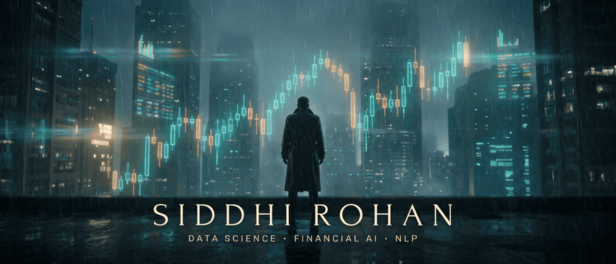

  

 

I train models and build the pipelines around them. M.S. in Data Science from the University of Maryland (2025), and before that a few years of data engineering and data science work in India. Most of what I build sits somewhere between finance, healthcare, and language.

 

## Where I work

<table>
  <tr>
    <td width="50%"></td>
    <td width="50%"></td>
  </tr>
  <tr>
    <td valign="top"><b>Financial AI</b> Market sentiment, fraud detection, time series. Where the signal is small and the cost of being wrong is not.</td>
    <td valign="top"><b>Healthcare AI</b> Risk prediction and clinical decision support. Models that have to explain themselves before anyone will use them.</td>
  </tr>
  <tr>
    <td width="50%"></td>
    <td width="50%"></td>
  </tr>
  <tr>
    <td valign="top"><b>NLP</b> Transformers for sentiment, summarisation, and retrieval. Turning documents into things a system can act on.</td>
    <td valign="top"><b>ML Engineering</b> Pipelines, serving, and the boring parts that decide whether a model survives contact with production.</td>
  </tr>
</table>

 

## Work I'd show first

<table>
  <tr>
    <td width="33%" valign="top">
      
      <h3><a href="https://github.com/SiddhiRohan/arbiter">Arbiter</a></h3>
      
Governance middleware between your app and an LLM API. Decides what data the model is allowed to see, enforces roles, and logs what it said back.

      
Python · FastAPI

    </td>
    <td width="33%" valign="top">
      
      <h3><a href="https://github.com/SiddhiRohan/VesprAI">VesprAI</a></h3>
      
Financial intelligence platform. Transformer sentiment over market news, document summarisation, and a fraud detector that takes more than one approach.

      
PyTorch · Transformers

    </td>
    <td width="33%" valign="top">
      
      <h3><a href="https://github.com/SiddhiRohan/sceneiq">SceneIQ</a></h3>
      
Vision Transformer that flags logically inconsistent photographs. 94.4% accuracy on held-out data. Built for MSML640 at UMD.

      
PyTorch · ViT

    </td>
  </tr>
</table>

Also worth a look: [MedPal](https://github.com/SiddhiRohan/MedPal), a study companion that watches for burnout, and [SpaCySeleniumBTC](https://github.com/SiddhiRohan/SpaCySeleniumBTC), which correlates Bitcoin tweet sentiment with price. The older Kaggle-style notebooks are still here if you scroll far enough.

 

## Recently

<!--START_SECTION:activity-->
- Pushed to [SiddhiRohan/siddhirohan.github.io](https://github.com/SiddhiRohan/siddhirohan.github.io): *Rebuild as scroll-narrative site with morphing particle field* 1d ago
<!--END_SECTION:activity-->

  

 

## Right now

Looking for a data science or ML engineering role where models actually ship. If you work on financial ML or LLM infrastructure, I'd like to talk.

 

## Tools

Python, SQL, PyTorch, Hugging Face Transformers, FastAPI, scikit-learn, Docker, React, Git.

 

  <a href="https://www.linkedin.com/in/siddhi-rohan/">LinkedIn</a>
  &nbsp;&nbsp;·&nbsp;&nbsp;
  <a href="mailto:siddhirohanwork@gmail.com">Email</a>
  &nbsp;&nbsp;·&nbsp;&nbsp;
  <a href="https://dot.cards/siddhirohan">dot.cards</a>

  

