  

I build ML systems end to end — the models and the pipelines that feed them. Recently finished my M.S. in Data Science at the University of Maryland; before that I did data engineering and data science work in Bangalore. Most of what I make lands somewhere in financial AI, healthcare AI, or NLP.

---

### Selected work

| | | |
|---|---|---|
| **Arbiter** | AI governance middleware — a policy enforcement and RBAC layer that sits between applications and LLM APIs. *Control what AI sees. Verify what AI says.* | Python · FastAPI |
| **[VesprAI](#https://github.com/SiddhiRohan/VesprAI)** | Financial intelligence platform: transformer-based sentiment analysis over market news, plus fraud detection. | PyTorch · Transformers |
| **[SceneIQ](#https://github.com/SiddhiRohan/sceneiq)** | ViT-based scene coherence classifier. 94.4% accuracy on held-out data. | PyTorch · ViT |

*Older experiments (expense trackers, hackathon entries, coursework) live in the pinned repos below.*

---

### Now

Building out Arbiter, and looking for data science / ML engineering roles where I can ship models to production, not just notebooks. If you're working on anything in financial ML or LLM infrastructure, I'd like to hear about it.

---

### Tools I reach for

`python` `sql` `pytorch` `transformers` `fastapi` `react` `git`

---

  
    <a href="#">https://www.linkedin.com/in/siddhi-rohan/</a> &nbsp;·&nbsp;
    <a href="mailto:siddhirohanwork@email.com">Email</a> &nbsp;·&nbsp;
    <a href="#">https://dot.cards/siddhirohan</a>
  

<i>fig. 02 — say hello</i>

