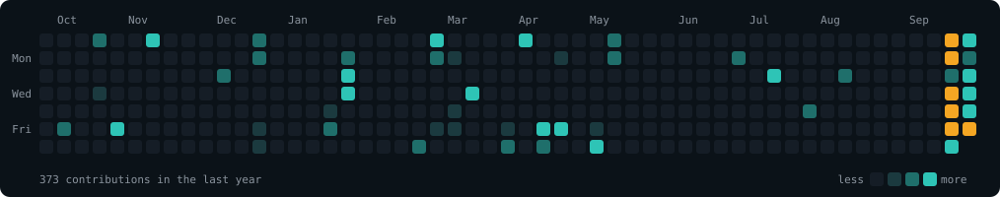

  

 

I train models and build the pipelines around them. 
M.S. in Data Science from the University of Maryland (2026), and before that a few years of data engineering 
and data science work in India. Most of what I build sits somewhere between finance, healthcare, and language.

  

## Where I work

<table>
  <tr>
    <td width="50%"></td>
    <td width="50%"></td>
  </tr>
  <tr>
    <td valign="top"><b>Financial AI</b> Market sentiment, fraud detection, time series. Where the signal is small and the cost of being wrong is not.</td>
    <td valign="top"><b>Healthcare AI</b> Risk prediction and clinical decision support. Models that have to explain themselves before anyone will use them.</td>
  </tr>
  <tr>
    <td width="50%"></td>
    <td width="50%"></td>
  </tr>
  <tr>
    <td valign="top"><b>NLP</b> Transformers for sentiment, summarisation, and retrieval. Turning documents into things a system can act on.</td>
    <td valign="top"><b>ML Engineering</b> Pipelines, serving, and the boring parts that decide whether a model survives contact with production.</td>
  </tr>
</table>

  

## Work I'd show first

### [Arbiter](https://github.com/SiddhiRohan/arbiter) &nbsp;Python · FastAPI

Governance middleware that sits between an application and an LLM API. It decides what data the model is allowed to see, enforces role-based access before a prompt ever leaves the building, and logs what came back. Built for the case where the model is not the risk, the data you hand it is.

 

### [VesprAI](https://github.com/SiddhiRohan/VesprAI) &nbsp;PyTorch · Transformers

An end-to-end financial intelligence platform. Transformer models score sentiment across market news, long filings get summarised automatically, and a fraud detector combines several approaches rather than trusting one. The output is meant to be read by someone deciding where to put money, not by another model.

 

### [SceneIQ](https://github.com/SiddhiRohan/sceneiq) &nbsp;PyTorch · ViT

A Vision Transformer that flags photographs with logical inconsistencies: shadows going the wrong way, reflections that don't match, objects that couldn't be where they are. 94.4% accuracy on held-out data. Built for MSML640 at the University of Maryland.

 

Also on the shelf: <a href="https://github.com/SiddhiRohan/MedPal">MedPal</a>, a study companion that watches for burnout, and <a href="https://github.com/SiddhiRohan/edushield">EduShield</a>, a role-governed AI connector for university records built at the Quantum Leap 2026 hackathon.

  

## Background

<table>
  <tr>
    <td width="50%" valign="top">
      <b>University of Maryland</b> 
      M.S. Data Science, 2026. Coursework in machine learning, NLP, computer vision, and data engineering. SceneIQ and VesprAI both started here.
    </td>
    <td width="50%" valign="top">
      <b>Before that</b> 
      Data engineering and data science roles in India. Pipelines, warehouses, and the first models I ever put in front of real users.
    </td>
  </tr>
</table>

  

## Last twelve months

  

  

## Right now

Looking for a data science or ML engineering role where models actually ship. If you work on financial ML or LLM infrastructure, I'd like to talk.

 

## Tools

Python, SQL, PyTorch, Hugging Face Transformers, FastAPI, scikit-learn, Docker, React, Git.

  

  <a href="https://www.linkedin.com/in/siddhi-rohan/">LinkedIn</a>
  &nbsp;&nbsp;·&nbsp;&nbsp;
  <a href="mailto:siddhirohanwork@gmail.com">Email</a>
  &nbsp;&nbsp;·&nbsp;&nbsp;
  <a href="https://dot.cards/siddhirohan">dot.cards</a>

  

